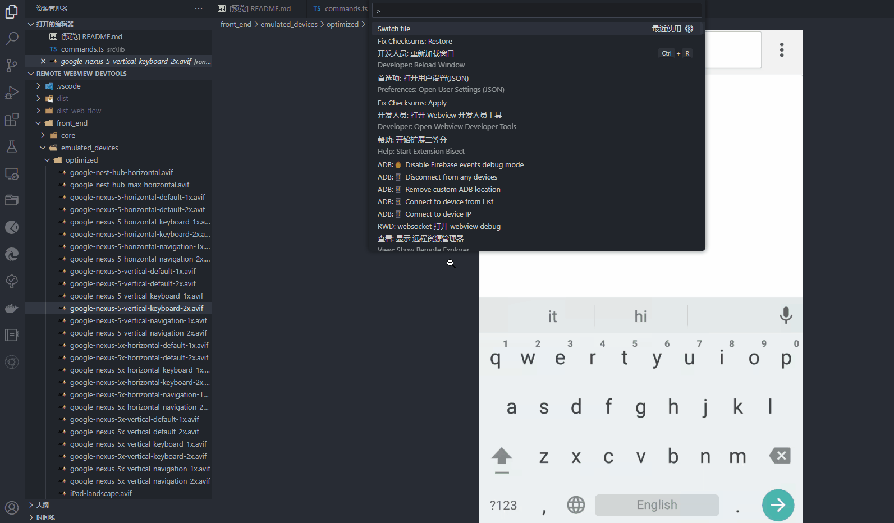
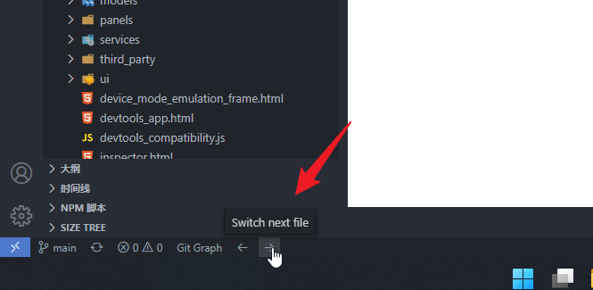
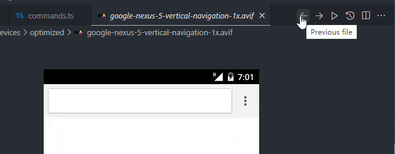

# switch-file

## Quick switch previous/next file

#### using command `Switch File`
- open commandPalette and search `Switch File`.
- 

#### using status bar item
- active by setting `"switch-file.statusBar": true`, default setting is `true`.
- 

#### using switch button
- active by setting `"switch-file.title": true`.
- 